# C4 Model - Level 2: Container Diagram (The Data Migrator)

## 🎯 Objective
This diagram illustrates the high-level boundaries of the migration system. It shows how the **Java Orchestrator** acts as a bridge between the legacy binary storage (VMDS) and the modern GridOS-ready persistence layer (PostGIS).

```mermaid
graph LR
    subgraph Smallworld_Internal [Smallworld 4.3 Environment]
        VMDS[(VMDS Database)] -- "Binary 4kb Blocks" --> Magik_Srv[Magik Metadata Service]
    end

    subgraph Java_Middleware [The Data Migrator - Java Engine]
        JNI[Java Native Interface / JNI] -- "Metadata Extraction" --> Logic[Transformation Logic]
        Logic -- "SQL Adapter" --> JDBC[JDBC Driver]
    end

    subgraph Target_Persistence [GridOS Persistence Layer]
        PostGIS[(PostgreSQL / PostGIS)]
    end

    %% Connections
    Magik_Srv -- "Dynamic Collections" --> JNI
    JDBC -- "Record-Based Persistence" --> PostGIS

    %% Styles
    style VMDS fill:#f9f,stroke:#333
    style PostGIS fill:#00b2a9,color:#fff
    style Java_Middleware fill:#005da9,color:#fff
```


## 🏛️ Architect's Perspective: Container Strategy
1.  **Magik Metadata Service:** Its responsibility is restricted to reading the CASE Tool definitions (`dd_table`). It should not handle SQL logic.
2.  **Java Engine (The Orchestrator):** This is the core container. It manages memory and batch processing. By using **JNI (Smallworld Java Interoperability)**, we ensure "Transparent Data Access".
3.  **PostGIS Landing Zone:** Aligned with **GE Vernova’s GridOS**, this container democratizes GIS data, enabling future consumption by JavaScript/TypeScript web-GIS frameworks.

---
**Next Step (Saturday Lab):** Implement a Magik script to extract field names and types from the `road` collection to feed the Java logic.
```
