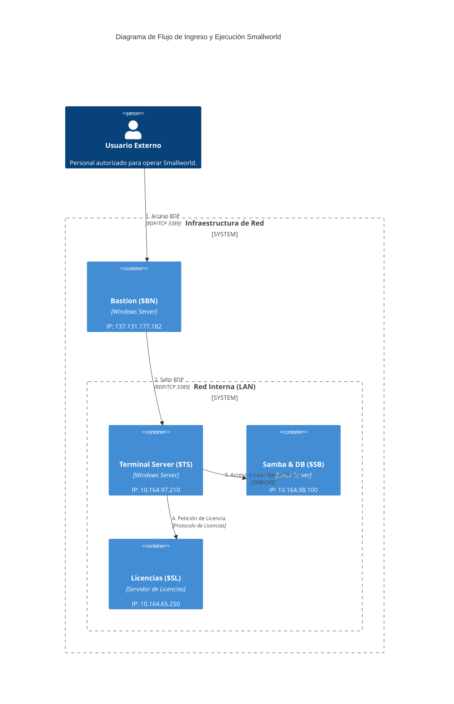

Aquí tienes el contenido completo listo para ser guardado en un archivo con extensión `.md` (por ejemplo: `flujo_acceso_servidores.md`). 

He utilizado la sintaxis **C4Container** que es la más estándar y compatible de Mermaid para el modelo C4, y he incluido una tabla descriptiva para mayor claridad.

---

```markdown
# Documentación de Flujo de Acceso - Sistema Smallworld

Este documento detalla el procedimiento técnico y la arquitectura de red para el ingreso a los servidores de la infraestructura y la ejecución de la aplicación Smallworld.

## 1. Diagrama de Arquitectura (C4 Model)

El siguiente diagrama representa los contenedores y el flujo lógico de la sesión.



## 2. Detalle de Servidores

| Identificador | Nombre del Servidor | Dirección IP | Sistema Operativo | Función |
| :--- | :--- | :--- | :--- | :--- |
| **$BN** | Bastion | 137.131.177.182 | Windows | Punto de entrada único desde Internet. |
| **$TS** | Terminal Server | 10.164.97.210 | Windows | Host donde se inicia la sesión de usuario final. |
| **$SB** | Samba y Base de Datos | 10.164.98.100 | Linux | Repositorio de archivos del sistema y datos. |
| **$SL** | Servidor de Licencias | 10.164.65.250 | - | Gestión de tokens de software. |

## 3. Flujo de Inicio de Sesión Paso a Paso

1.  **Conexión Inicial:** El usuario inicia una conexión de Escritorio Remoto (RDP) hacia el **Bastion ($BN)** utilizando la IP pública `137.131.177.182`.
2.  **Segundo Salto:** Una vez dentro del escritorio del Bastion, se abre una nueva sesión de RDP interna hacia el **Terminal Server ($TS)** en la IP `10.164.97.210`.
3.  **Localización del Ejecutable:** En el Terminal Server, se debe navegar hacia la ruta de red compartida ubicada en el servidor Linux **$SB** (`10.164.98.100`).
4.  **Ejecución de Smallworld:** Se localiza el archivo `.exe` en la ruta Samba y se ejecuta con doble clic.
5.  **Validación de Licencia:** Al iniciar, el sistema Smallworld en el Terminal Server contacta automáticamente al **Servidor de Licencias ($SL)** en la IP `10.164.65.250`. Si hay una licencia disponible, el sistema se abre correctamente.

---
*Nota: Este flujo garantiza que el tráfico interno nunca esté expuesto directamente a internet, utilizando el Bastion como único punto de inspección.*
```

---

### ¿Cómo visualizarlo?
1.  **VS Code:** Instala la extensión "Markdown Preview Mermaid Support".
2.  **GitHub/GitLab:** Copia el código en un archivo `.md` y súbelo; se renderizará automáticamente.
3.  **Obsidian:** Simplemente pega el código en una nota.
4.  **Navegador:** Puedes pegar el código de Mermaid en el [Mermaid Live Editor](https://mermaid.live/) para exportarlo como imagen si lo necesitas.
